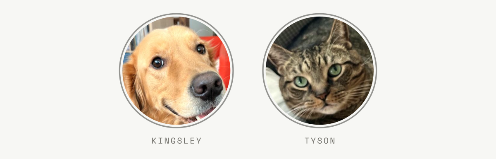

<picture>
  <source media="(prefers-color-scheme: dark)" srcset="img/f-split-code-dark.svg">
  
</picture>

<picture>
  <source media="(prefers-color-scheme: dark)" srcset="img/head-about-dark.svg">
  
</picture>

- 💻 JavaScript developer based in Toronto, ON who enjoys building software focused on the user-experience

- 🌱 Currently: sharpening my skills through coding challenges and refining my agentic workflow

- 📫 How to reach me: [kcgbarbosa@gmail.com](mailto:kcgbarbosa@gmail.com)
- 💼 I'd be **thrilled** to connect: [linkedin.com/in/kcgbarbosa](https://www.linkedin.com/in/kcgbarbosa)

<picture>
  <source media="(prefers-color-scheme: dark)" srcset="img/head-stack-dark.svg">
  
</picture>

<picture>
  <source media="(prefers-color-scheme: dark)" srcset="img/head-pets-dark.svg">
  
</picture>

<picture>
  <source media="(prefers-color-scheme: dark)" srcset="img/co-maintainers-dark.svg">
  
</picture>
Grateful that my repo maintenance is handled by a pair of talented orchestrators.
